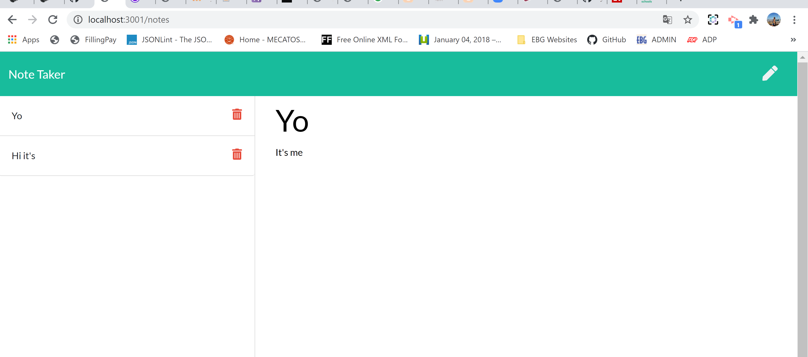

# Note Taker

## Table of Contents:

- [Description](#description)
- [Instructions](#instructions)
- [Developed](#developed)
- [Website](#website)

## Description

- This application allows a user to keep his notes in one place.
- The user can add new notes, edit and delete those.

## Instructions

- To add a new note the user should click on a pen icon located in the top right corner
- To save a note the user should click the save icon in the top right corner
- To edit a note the user should click on a note he would like to edit
- To delete a note the user should click on a bin icon located next to an existing note

## Developed with

- HTML, CSS, Javascript
- Node.js
- Express.js

## Website

[Deployed Notes](https://shrouded-depths-67609.herokuapp.com/)
